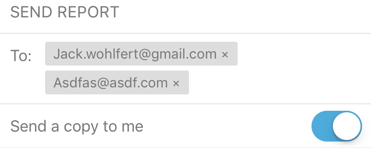

# React Native Tag Input



Simple Example

```jsx
import TagInput from 'react-native-tag-input';

...

<TagInput
  value={this.state.emails}
  onChange={(emails) => this.setState({ emails })}
  labelExtractor={(email) => email}
  text={this.state.text}
  onChangeText={(text) => this.setState({ text })}
/>
```

| Available Properties | Description                                                                                                                                                                                                                        |
| -------------------- | ---------------------------------------------------------------------------------------------------------------------------------------------------------------------------------------------------------------------------------- |
| value                | (Required) An array of tags, which can be any type, as long as labelExtractor below can extract a string from it                                                                                                                   |
| onChange             | (Required) A handler to be called when array of tags change. The parent should update the value prop when this is called if they want to enable removal of tags                                                                    |
| labelExtractor       | (Required) Function to extract string value for label from item. May also return an element to be shown in place of text, in which case the tagTextColor and tagTextStyle props will be ignored.                                                                                                                                                                    |
| text                 | (Required) The text currently being displayed in the TextInput following the list of tags                                                                                                                                          |
| onChangeText         | (Required) This callback gets called when the user types in the TextInput. The parent should update the text prop when this is called if they want to enable input. This is also where any parsing to detect new tags should occur |
| editable             | If false, text input is not editable and existing tags cannot be removed. (default is `true`)                                                                                                                                      |
| tagColor             | Background color of tags                                                                                                                                                                                                           |
| tagTextColor         | Text color of tags                                                                                                                                                                                                                 |
| tagContainerStyle    | Styling override for container surrounding tag text                                                                                                                                                                                |
| tagTextStyle         | Styling override for tag's text component                                                                                                                                                                                          |
| inputDefaultWidth    | Width override for text input's default width when it's empty and showing placeholder                                                                                                                                              |
| inputColor           | Color of text input                                                                                                                                                                                                                |
| inputProps           | Any misc. TextInput props (autoFocus, placeholder, returnKeyType, etc.)                                                                                                                                                            |
| maxHeight            | Max height of the tag input on screen (will scroll if max height reached)                                                                                                                                                          |
| onHeightChange       | Callback that gets passed the new component height when it changes                                                                                                                                                                 |
| scrollViewProps      | Any ScrollView props (horizontal, showsHorizontalScrollIndicator, etc.)                                                                                                                                                            |
